# CherryQuant 系统架构可视化

本文档包含 CherryQuant 系统的完整架构图，帮助理解系统设计和数据流向。

---

## 目录

1. [C4 模型架构图](#c4-模型架构图)
   - [Level 1: 系统上下文图](#level-1-系统上下文图)
   - [Level 2: 容器图](#level-2-容器图)
   - [Level 3: 组件图](#level-3-组件图)
   - [Level 4: 代码图](#level-4-代码图)
2. [序列图](#序列图)
   - [数据采集流程](#数据采集流程)
   - [AI 决策流程](#ai-决策流程)
   - [交易执行流程](#交易执行流程)
3. [数据流图](#数据流图)
4. [数据库架构图](#数据库架构图)
5. [部署架构图](#部署架构图)

---

## C4 模型架构图

C4 模型提供了 4 个层次的抽象，帮助理解系统架构：
- **Level 1 (Context)**: 系统与外部的关系
- **Level 2 (Container)**: 系统内的高层组件
- **Level 3 (Component)**: 每个容器的内部结构
- **Level 4 (Code)**: 关键类的设计

### Level 1: 系统上下文图

展示 CherryQuant 与外部系统的交互。

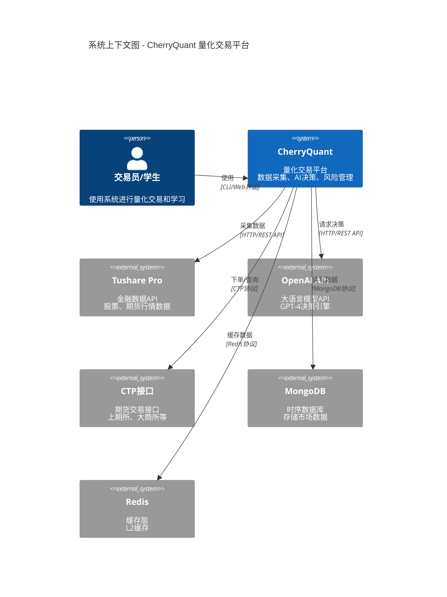

**说明**:
- **核心系统**: CherryQuant 平台
- **外部数据源**: Tushare Pro (行情数据)
- **AI 服务**: OpenAI API (决策支持)
- **交易接口**: CTP (实盘交易)
- **存储**: MongoDB (数据持久化) + Redis (缓存)

---

### Level 2: 容器图

展示 CherryQuant 内部的主要容器（应用程序、数据库等）。

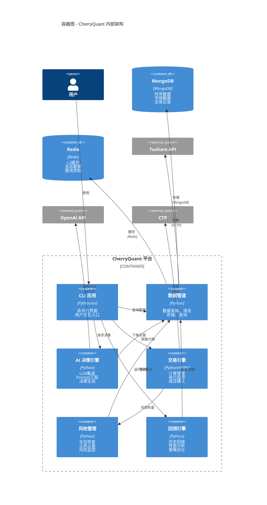

**容器说明**:

| 容器 | 职责 | 技术栈 |
|------|------|--------|
| CLI 应用 | 用户界面，命令解析 | Python, Click |
| 数据管道 | 数据全生命周期管理 | Python, Motor (MongoDB), Redis |
| AI 决策引擎 | LLM集成，决策生成 | Python, OpenAI SDK |
| 交易引擎 | 订单管理，执行监控 | Python, VNPy |
| 风险管理 | 风险检查，止损控制 | Python, Pydantic |
| 回测引擎 | 策略验证，性能分析 | Python, Pandas |

---

### Level 3: 组件图 - 数据管道

展示数据管道容器内的组件。

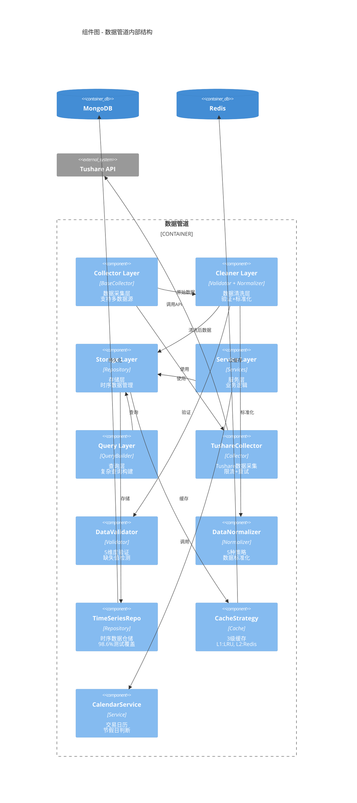

**设计模式应用**:

- **Template Method**: `BaseCollector` 定义采集骨架，子类实现具体逻辑
- **Strategy**: `DataNormalizer` 支持多种标准化策略
- **Repository**: `TimeSeriesRepository` 封装数据访问
- **Facade**: `DataPipeline` 提供统一接口
- **Cache Aside**: `CacheStrategy` 实现三级缓存

---

### Level 3: 组件图 - AI 决策引擎

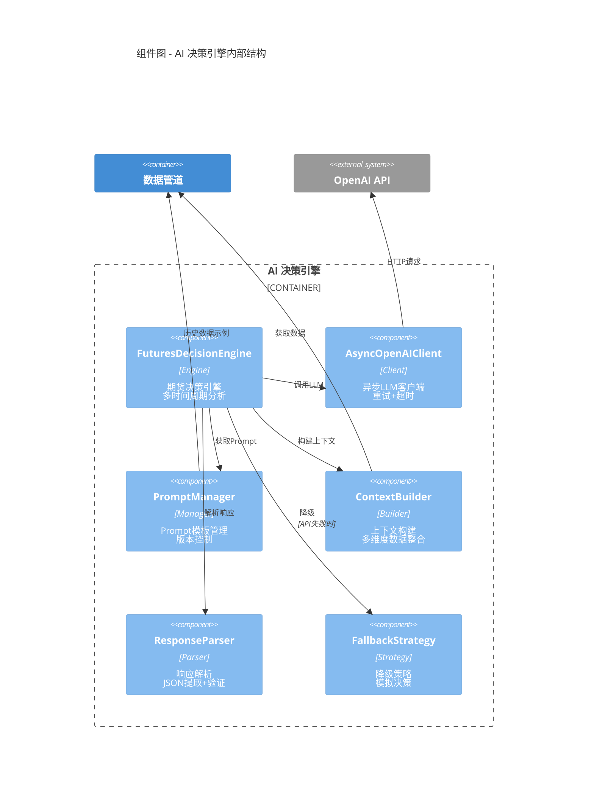

**AI 引擎特点**:
- **异步调用**: 所有 API 调用使用 async/await
- **重试机制**: 指数退避 + 熔断器
- **Prompt 工程**: 模板化管理，支持 Few-shot Learning
- **降级策略**: API 不可用时使用技术指标模拟

---

### Level 4: 代码图 - 核心类设计

展示关键类的属性和方法。

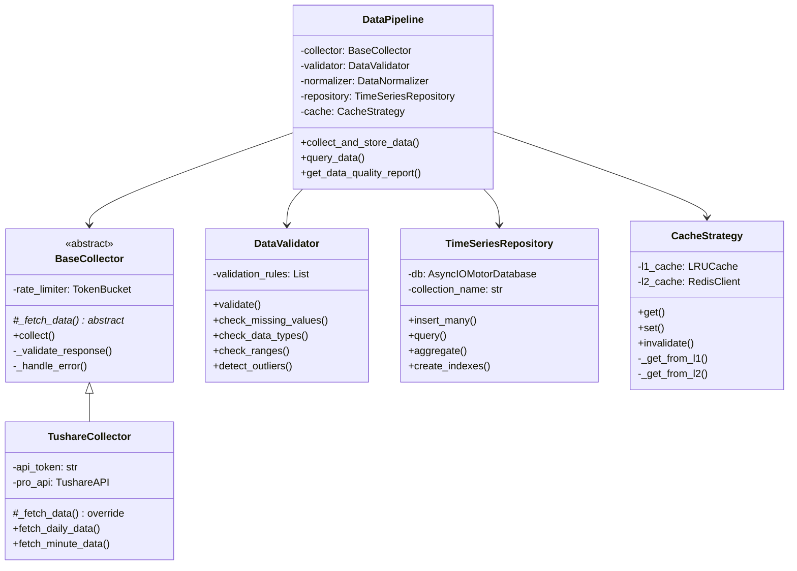

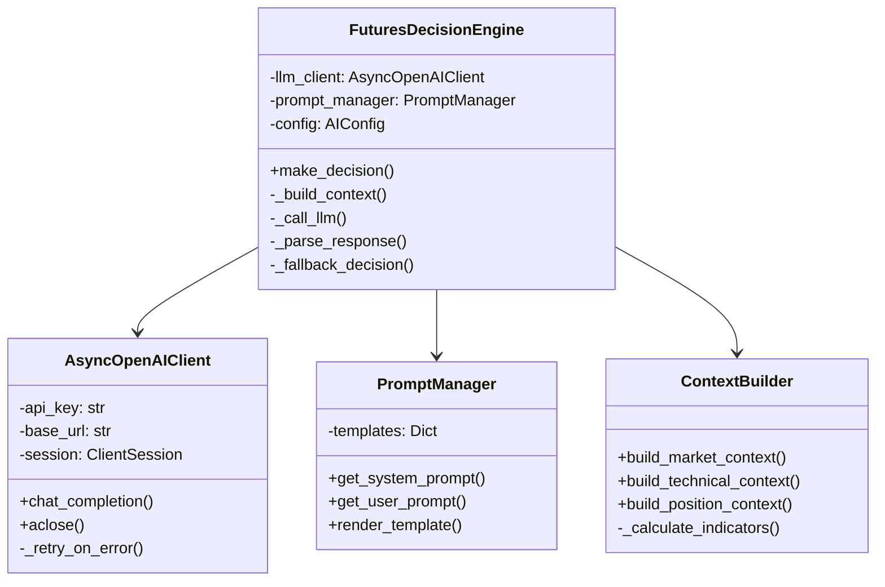

---

## 序列图

序列图展示系统在运行时的交互流程。

### 数据采集流程

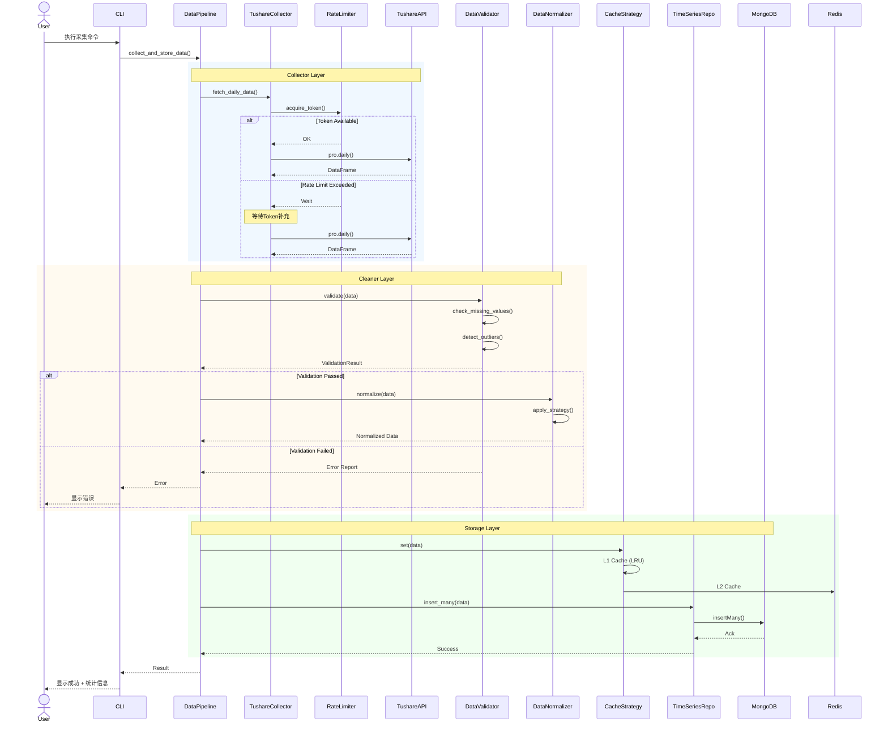

**关键步骤**:
1. **限流控制**: 使用 Token Bucket 算法
2. **数据验证**: 5维度验证（缺失值、类型、范围、异常值、一致性）
3. **缓存策略**: L1 (内存LRU) + L2 (Redis)
4. **错误处理**: 每一层都有错误恢复机制

---

### AI 决策流程

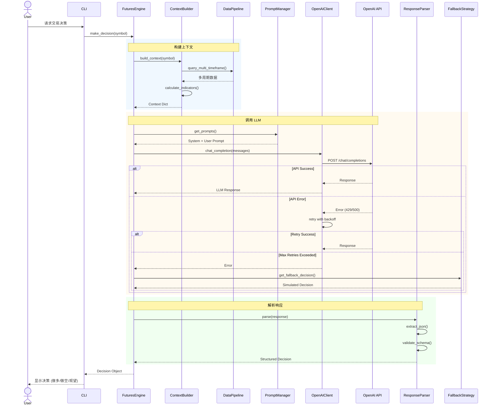

**决策生成步骤**:
1. **多维度上下文**: 5分钟、1小时、日线数据 + 技术指标
2. **Prompt 工程**: System Prompt (角色) + User Prompt (任务)
3. **容错机制**: 重试 + 熔断器 + 降级策略
4. **响应验证**: JSON 提取 + Schema 验证

---

### 交易执行流程

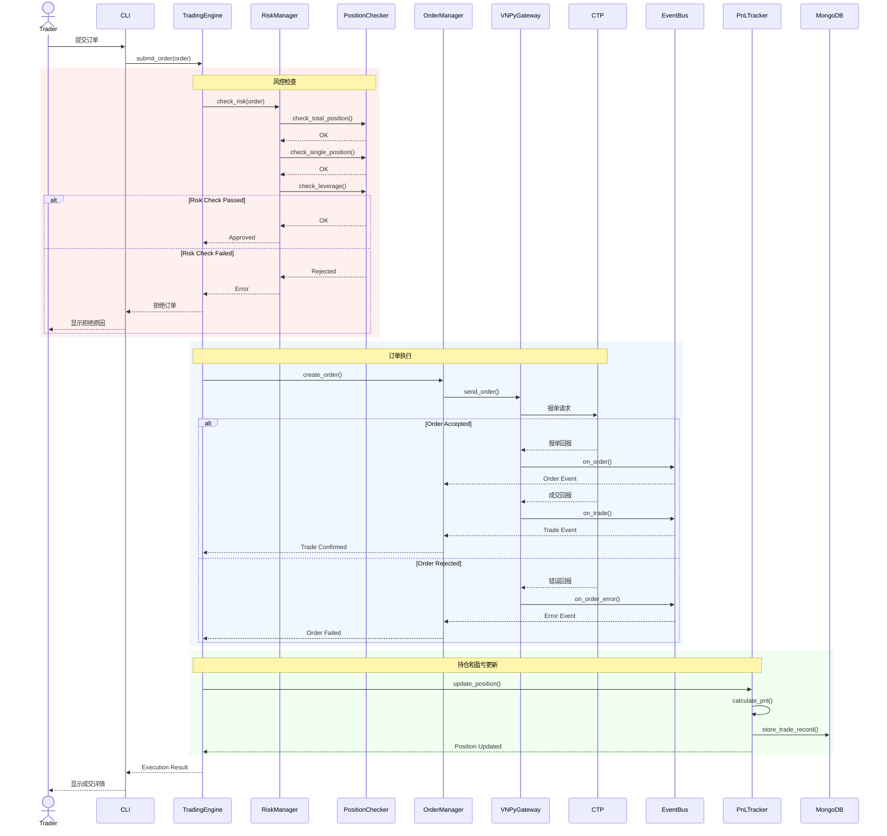

**风控流程**:
1. **总持仓检查**: 不超过 80% 资金
2. **单品种检查**: 不超过 30% 资金
3. **杠杆检查**: 不超过 3 倍
4. **止损止盈**: 实时监控

---

## 数据流图

展示数据在系统中的流动。

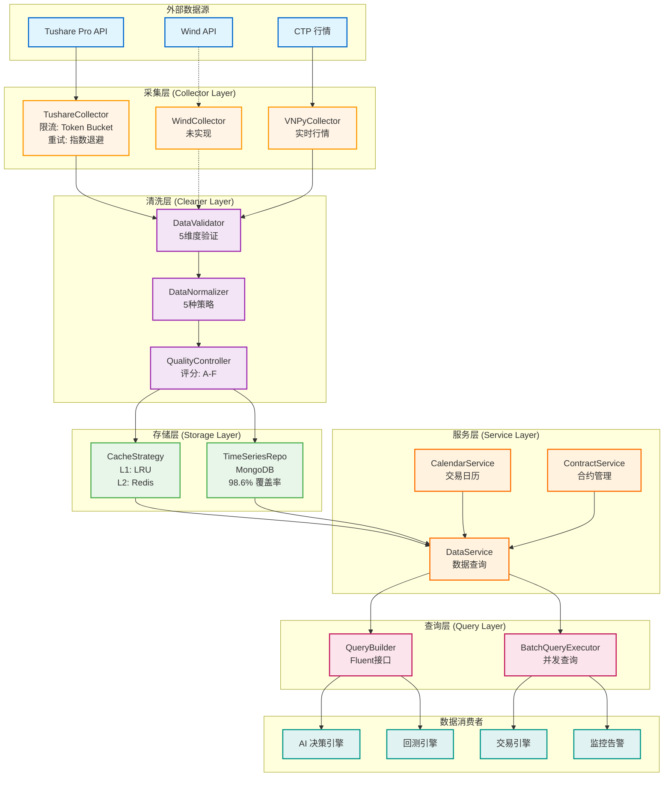

**数据流说明**:

1. **外部数据源** → **采集层**
   - Tushare Pro: 历史数据（日线、分钟线）
   - CTP: 实时行情（Tick 级别）

2. **采集层** → **清洗层**
   - 限流控制：每秒最多 N 次请求
   - 重试机制：失败后指数退避

3. **清洗层** → **存储层**
   - 验证：缺失值、类型、范围、异常值、一致性
   - 标准化：归一化、Z-Score、MinMax、Robust、Log
   - 质量评分：A (优秀) ~ F (不可用)

4. **存储层** → **服务层**
   - L1 缓存 (内存): LRU, 最多 1000 条
   - L2 缓存 (Redis): TTL = 1 小时
   - L3 持久化 (MongoDB): 时序集合 + 压缩

5. **服务层** → **查询层**
   - CalendarService: 判断交易日
   - ContractService: 主力合约切换
   - DataService: 统一数据接口

6. **查询层** → **消费者**
   - AI 引擎: 多时间周期数据
   - 回测引擎: 历史数据回放
   - 交易引擎: 实时行情订阅
   - 监控告警: 数据质量监控

---

## 数据库架构图

展示 MongoDB 数据库的集合设计和关系。

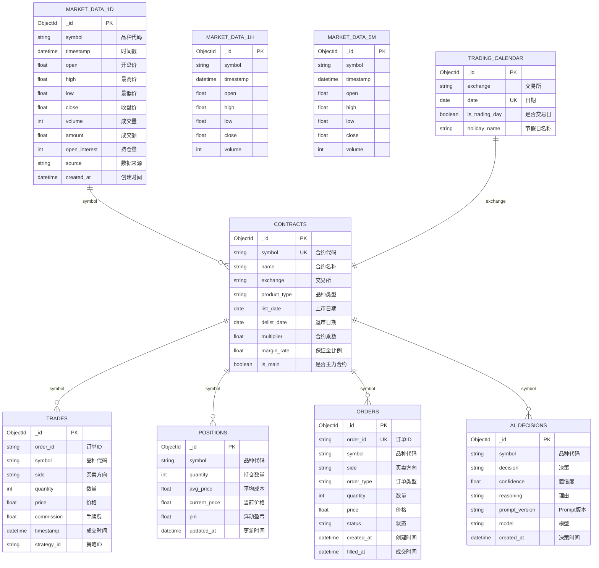

**集合说明**:

| 集合 | 类型 | 索引 | 大小估算 | 说明 |
|------|------|------|----------|------|
| market_data_1d | 时序集合 | (symbol, timestamp) | ~1GB/年 | 日线数据 |
| market_data_1h | 时序集合 | (symbol, timestamp) | ~5GB/年 | 小时线数据 |
| market_data_5m | 时序集合 | (symbol, timestamp) | ~50GB/年 | 5分钟线数据 |
| contracts | 普通集合 | (symbol unique) | ~1MB | 合约信息 |
| trading_calendar | 普通集合 | (exchange, date) | ~100KB | 交易日历 |
| trades | 普通集合 | (order_id), (symbol, timestamp) | ~10MB/年 | 交易记录 |
| positions | 普通集合 | (symbol unique) | ~10KB | 持仓信息 |
| orders | 普通集合 | (order_id unique), (status) | ~5MB/年 | 订单记录 |
| ai_decisions | 普通集合 | (symbol, created_at) | ~100MB/年 | AI决策记录 |

**性能优化**:
- **时序集合**: 使用 MongoDB 时序集合，自动压缩（~70% 空间节省）
- **复合索引**: (symbol, timestamp) 支持常见查询
- **TTL 索引**: 自动清理过期数据
- **分片策略**: 按 symbol + timestamp 分片（可选）

---

## 部署架构图

展示生产环境的部署方案。

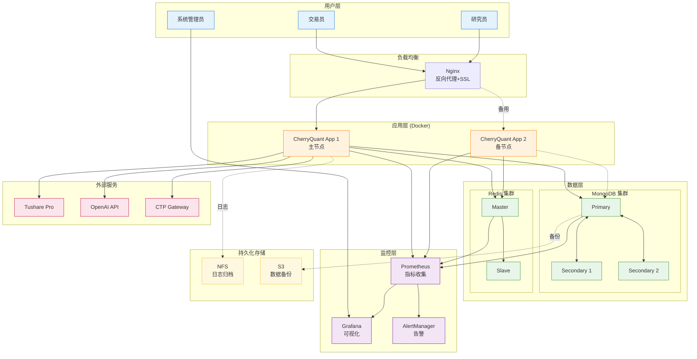

**部署配置**:

| 组件 | 配置 | 数量 | 备注 |
|------|------|------|------|
| Nginx | 2C4G | 1 | 反向代理+SSL |
| CherryQuant App | 4C8G | 2 | 主备模式 |
| MongoDB | 8C16G + 500GB SSD | 3 | 副本集 |
| Redis | 2C4G | 2 | 主从 |
| Prometheus | 2C4G | 1 | 监控数据保留 30 天 |
| Grafana | 2C4G | 1 | 可视化 |

**高可用方案**:
- **应用层**: 2个节点，Nginx 负载均衡
- **数据库**: MongoDB 副本集（1主2从），自动故障转移
- **缓存**: Redis 主从复制
- **监控**: Prometheus + Grafana + AlertManager

---

## 总结

本文档通过多层次、多视角的可视化图表，全面展示了 CherryQuant 系统的架构设计：

- **C4 模型**: 从宏观到微观，逐层展示系统结构
- **序列图**: 展示运行时的交互流程
- **数据流图**: 展示数据的生命周期
- **数据库架构**: 展示数据模型设计
- **部署架构**: 展示生产环境方案

这些图表不仅是文档，更是：
- **设计蓝图**: 指导开发实现
- **沟通工具**: 团队协作的共同语言
- **教学材料**: 帮助学生理解系统设计

**建议使用场景**:
- 📚 **学习**: 理解系统架构和设计思想
- 🛠️ **开发**: 查找组件位置和交互方式
- 🔍 **调试**: 追踪数据流和定位问题
- 📊 **展示**: 项目演示和技术分享

---

**相关文档**:
- [系统架构文档](./01_System_Architecture.md)
- [MongoDB Schema 设计](./MONGODB_SCHEMA_V2.md)
- [ADR 决策记录](../adr/)
