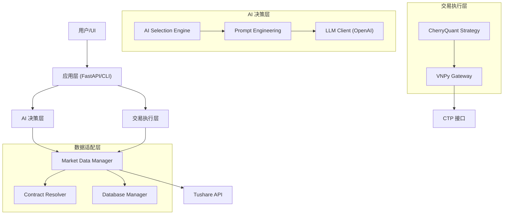

# CherryQuant 课程讲义 - 第1章：系统架构

## 1.1 项目概述
CherryQuant 是一个基于 AI 驱动的量化交易系统，专为中国期货市场设计。它结合了大型语言模型（LLM）的推理能力和传统量化交易框架（vn.py）的执行能力，旨在实现"零样本"（Zero-shot）的自动化交易。

### 核心目标
- **AI 驱动决策**: 利用 GPT-4 等先进模型分析市场数据、技术指标和宏观情绪。
- **双模式运行**: 
    - `Dev` 模式：使用 Tushare/QuantBox 数据进行开发和回测。
    - `Live` 模式：使用 CTP 接口（SimNow/实盘）进行实时交易。
- **模块化设计**: 高度解耦的架构，便于教学和扩展（如支持股票、加密货币）。

## 1.2 系统架构概览

CherryQuant 采用分层架构设计，主要分为以下几层：



### 核心组件说明

1.  **AI Selection Engine (`src/cherryquant/ai/decision_engine`)**:
    - 系统的"大脑"。负责收集市场数据，构造 Prompt，调用 LLM，并解析 AI 的交易决策。
    - 包含重试机制和严格的 JSON 校验，防止 AI "幻觉"。

2.  **Market Data Manager (`src/cherryquant/adapters/data_adapter`)**:
    - 数据的"调度员"。统一管理 Tushare、SimNow、数据库等多种数据源。
    - 支持自动降级（Fallback）：如果主数据源不可用，自动切换到备用数据源。

3.  **Contract Resolver (`src/cherryquant/adapters/data_adapter`)**:
    - 负责将通用品种代码（如 `rb`）解析为具体的交易合约（如 `rb2501.SHFE`）。
    - 支持期货主力合约的动态查询和推断。

4.  **VNPy Gateway (`src/trading/vnpy_gateway.py`)**:
    - 与 vn.py 框架的桥梁。封装了底层 CTP 接口的复杂性，提供简单的 Python 异步接口。

## 1.3 数据流向

### 实时交易流程 (Live Mode)
1.  **行情订阅**: `VNPy Gateway` 连接 CTP，订阅主力合约行情。
2.  **数据清洗**: `Realtime Recorder` 将 Tick 数据聚合为 K 线，存入数据库。
3.  **AI 决策**: 
    - `Strategy` 定时触发决策请求。
    - `AI Engine` 从 `Market Data Manager` 获取最新 K 线和技术指标。
    - 构造 Prompt 发送给 GPT-4。
4.  **信号执行**: 
    - AI 返回 JSON 格式的决策（买入/卖出/观望）。
    - `Strategy` 验证信号，计算仓位，通过 `VNPy Gateway` 下单。

## 1.4 目录结构
```
CherryQuant/
├── docs/               # 文档和课程讲义
├── src/
│   ├── cherryquant/    # 核心业务逻辑
│   │   ├── adapters/   # 数据适配器
│   │   ├── ai/         # AI 引擎
│   │   └── config/     # 配置管理
│   ├── trading/        # 交易执行层 (vn.py 集成)
│   └── utils/          # 通用工具
├── tests/              # 单元测试
├── .env                # 环境变量 (API Key, 账号等)
└── requirements.txt    # 项目依赖
```

## 1.5 思考题
1.  为什么我们需要 `Contract Resolver`？直接硬编码 `rb2501` 有什么问题？
2.  `Market Data Manager` 如何处理数据源故障？
3.  AI 返回的决策如果是错误的 JSON 格式，系统会怎么处理？
