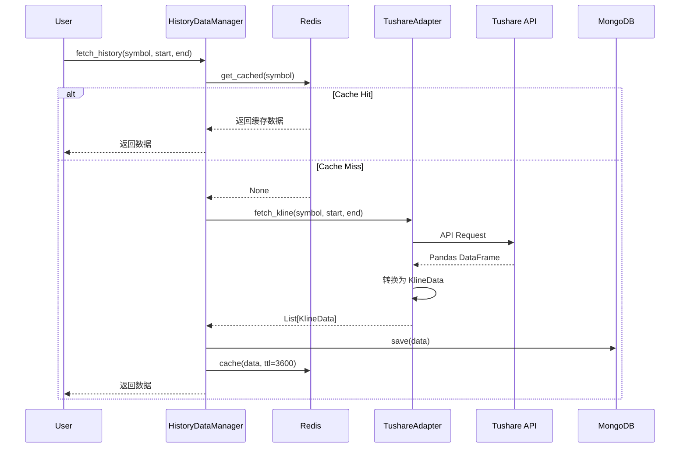

# Lab 02: 追踪数据流

## 实验信息

- **难度**: ⭐⭐ 初级
- **预计时间**: 3 小时
- **相关模块**: Module 1 (系统架构), Module 2 (数据管道)
- **截止日期**: Week 3 结束

## 学习目标

完成本实验后，你将能够：

1. ✅ 理解 CherryQuant 的数据流向（从数据源到存储）
2. ✅ 掌握六边形架构中的适配器模式
3. ✅ 使用 Tushare 获取期货历史数据
4. ✅ 理解 MongoDB 时间序列集合的设计
5. ✅ 使用 Redis 进行数据缓存
6. ✅ 调试和追踪数据处理流程

## 实验前准备

### 前置实验

- [x] Lab 01: 环境搭建与首次运行

### 必备知识

- [ ] 理解 Python 异步编程 (`async/await`)
- [ ] 了解 MongoDB 基础概念
- [ ] 了解 Redis 基础概念

### 需要的 API 密钥

- [ ] Tushare Token (免费注册获取)

### 参考资料

- 📖 `docs/course/01_System_Architecture.md`
- 📖 `docs/course/02_Data_Pipeline.md`
- 📖 `examples/02_data/README.md`

## 实验背景

在 CherryQuant 系统中，数据流是核心流程之一：

```
数据源 → 数据适配器 → 数据管理器 → 数据库/缓存 → AI 决策引擎
  ↑                                        ↓
  └──────────── 历史数据查询 ←───────────────┘
```

本实验将带你追踪一条数据从 Tushare API 到 MongoDB 的完整旅程。

---

## 实验任务

### 任务 1: 注册并配置 Tushare (20 分钟)

#### 1.1 注册 Tushare 账号

1. 访问 https://tushare.pro
2. 点击"注册"创建账号
3. 验证邮箱并登录
4. 进入"个人中心" → "接口 Token"
5. 复制你的 Token (类似 `abc123def456...`)

#### 1.2 配置 Token 到 .env

编辑 `.env` 文件，添加:

```bash
# Tushare 配置
TUSHARE_TOKEN=你的_token_这里
```

**⚠️ 重要**:
- Token 是私密信息，不要提交到 Git
- 免费用户有积分限制，合理使用

#### 1.3 测试 Token

创建测试脚本 `test_tushare.py`:

```python
"""测试 Tushare Token 是否有效"""
import tushare as ts

# 从环境变量读取 Token
from config.settings.settings import get_settings

settings = get_settings()
token = settings.tushare_token

# 初始化接口
pro = ts.pro_api(token)

# 测试查询
df = pro.daily(ts_code='000001.SZ', start_date='20240101', end_date='20240110')
print(f"✅ Token 有效！获取到 {len(df)} 条数据")
print(df.head())
```

运行测试:
```bash
uv run python test_tushare.py
```

**✅ 检查点**: 成功获取数据并输出

---

### 任务 2: 理解数据适配器模式 (30 分钟)

#### 2.1 阅读适配器接口定义

打开 `src/cherryquant/adapters/data_adapter/history_data_manager.py`

**关键概念**:

1. **DataAdapter Protocol** (接口)
   ```python
   class DataAdapter(Protocol):
       async def fetch_kline(...) -> List[KlineData]:
           ...
   ```

2. **TushareAdapter** (实现)
   ```python
   class TushareAdapter:
       async def fetch_kline(...) -> List[KlineData]:
           # 调用 Tushare API
           # 转换数据格式
           ...
   ```

#### 2.2 绘制适配器类图

**要求**: 绘制以下类的关系图

```
DataAdapter (Protocol/Interface)
    ├── TushareAdapter
    ├── VNPyAdapter
    └── QuantBoxAdapter

HistoryDataManager
    └── uses → DataAdapter
```

**使用工具**: 手绘或 draw.io, PlantUML

**✅ 检查点**: 完成类图绘制

#### 2.3 回答问题

在实验报告中回答:

1. **为什么使用 Protocol 而不是继承？**
2. **适配器模式的优势是什么？**
3. **如果要新增一个数据源（如 Wind），需要修改哪些代码？**

---

### 任务 3: 追踪历史数据获取流程 (45 分钟)

#### 3.1 创建数据获取脚本

创建 `lab02_fetch_data.py`:

```python
"""
Lab 02: 数据获取流程追踪

这个脚本演示如何从 Tushare 获取历史数据并保存到 MongoDB
"""

import asyncio
from datetime import datetime
import structlog

# 配置日志
structlog.configure(
    processors=[
        structlog.processors.add_log_level,
        structlog.processors.TimeStamper(fmt="iso"),
        structlog.dev.ConsoleRenderer(),
    ]
)

logger = structlog.get_logger()

from config.settings.settings import get_settings
from cherryquant.bootstrap.app_context import create_app_context
from cherryquant.adapters.data_adapter.history_data_manager import HistoryDataManager


async def main():
    """主函数"""
    logger.info("🚀 开始 Lab 02: 数据流追踪实验")

    # 步骤 1: 创建应用上下文
    logger.info("步骤 1: 创建应用上下文 (Composition Root)")
    app = await create_app_context()

    try:
        # 步骤 2: 创建数据适配器
        logger.info("步骤 2: 创建 Tushare 数据适配器")
        from cherryquant.adapters.data_adapter.tushare_adapter import TushareAdapter

        adapter = TushareAdapter(token=app.config.tushare_token)

        # 步骤 3: 创建历史数据管理器（注入适配器）
        logger.info("步骤 3: 创建历史数据管理器（依赖注入）")
        history_manager = HistoryDataManager(
            adapter=adapter,
            storage=app.db
        )

        # 步骤 4: 获取数据
        symbol = "rb2501"  # 螺纹钢主力合约
        start_date = datetime(2024, 1, 1)
        end_date = datetime(2024, 1, 31)

        logger.info(
            "步骤 4: 从 Tushare 获取历史数据",
            symbol=symbol,
            start=start_date.strftime("%Y-%m-%d"),
            end=end_date.strftime("%Y-%m-%d")
        )

        data = await history_manager.fetch_history(
            symbol=symbol,
            start_date=start_date,
            end_date=end_date
        )

        if data:
            logger.info(
                "✅ 数据获取成功",
                count=len(data),
                first_date=data[0].datetime if data else None,
                last_date=data[-1].datetime if len(data) > 0 else None
            )

            # 显示前 5 条数据
            print("\n📊 前 5 条 K 线数据:")
            for i, kline in enumerate(data[:5]):
                print(f"  {i+1}. {kline.datetime.strftime('%Y-%m-%d')} "
                      f"开:{kline.open} 高:{kline.high} "
                      f"低:{kline.low} 收:{kline.close} "
                      f"量:{kline.volume}")

        else:
            logger.warning("❌ 未获取到数据")

        # 步骤 5: 验证数据是否保存到 MongoDB
        logger.info("步骤 5: 验证数据是否保存到 MongoDB")

        # 直接查询 MongoDB
        mongo_data = await app.db.mongodb_manager.find(
            collection="kline_data",
            filter={"symbol": symbol},
            limit=5
        )

        logger.info(
            "MongoDB 中的数据",
            count=len(mongo_data) if mongo_data else 0
        )

        # 步骤 6: 测试缓存（第二次获取应该更快）
        logger.info("步骤 6: 测试缓存效果（第二次获取）")

        import time
        start_time = time.time()

        data_cached = await history_manager.fetch_history(
            symbol=symbol,
            start_date=start_date,
            end_date=end_date
        )

        elapsed = time.time() - start_time

        logger.info(
            "✅ 第二次获取完成",
            elapsed_seconds=f"{elapsed:.2f}",
            from_cache="是" if elapsed < 0.5 else "否"
        )

    finally:
        # 步骤 7: 清理资源
        logger.info("步骤 7: 关闭连接")
        await app.close()

    logger.info("🎉 Lab 02 实验完成！")


if __name__ == "__main__":
    asyncio.run(main())
```

#### 3.2 运行并观察输出

```bash
uv run python lab02_fetch_data.py
```

**预期输出**:
```
🚀 开始 Lab 02: 数据流追踪实验
步骤 1: 创建应用上下文 (Composition Root)
步骤 2: 创建 Tushare 数据适配器
步骤 3: 创建历史数据管理器（依赖注入）
步骤 4: 从 Tushare 获取历史数据  symbol=rb2501
✅ 数据获取成功  count=22

📊 前 5 条 K 线数据:
  1. 2024-01-02 开:3500 高:3520 低:3490 收:3510 量:12345
  ...

步骤 5: 验证数据是否保存到 MongoDB
MongoDB 中的数据 count=22

步骤 6: 测试缓存效果（第二次获取）
✅ 第二次获取完成 elapsed_seconds=0.15 from_cache=是

步骤 7: 关闭连接
🎉 Lab 02 实验完成！
```

**✅ 检查点**:
- 数据成功获取
- 数据保存到 MongoDB
- 第二次获取明显更快（缓存生效）

#### 3.3 使用调试器追踪

**在 VS Code 中设置断点**:

1. 打开 `lab02_fetch_data.py`
2. 在以下位置设置断点:
   - `adapter = TushareAdapter(...)` 之后
   - `data = await history_manager.fetch_history(...)` 之前
   - `data = await history_manager.fetch_history(...)` 之后

3. 按 F5 运行调试
4. 逐步执行，观察变量值

**调试要点**:
- 观察 `adapter` 对象的结构
- 观察 `data` 列表的内容
- 理解异步函数的执行顺序

**✅ 检查点**: 完成调试过程，在报告中描述观察到的关键变量

---

### 任务 4: 理解数据存储设计 (30 分钟)

#### 4.1 查看 MongoDB 数据结构

使用 MongoDB 客户端查看数据:

```bash
# 方式 1: 使用 Docker exec
docker exec -it cherryquant-mongodb mongosh

# 进入数据库
use cherryquant_dev

# 查看集合
show collections

# 查询 K 线数据
db.kline_data.findOne()

# 查看索引
db.kline_data.getIndexes()
```

**预期数据结构**:
```json
{
  "_id": ObjectId("..."),
  "symbol": "rb2501",
  "datetime": ISODate("2024-01-02T00:00:00.000Z"),
  "open": 3500.0,
  "high": 3520.0,
  "low": 3490.0,
  "close": 3510.0,
  "volume": 12345,
  "open_interest": 54321,
  "created_at": ISODate("2024-01-15T10:30:00.000Z")
}
```

**✅ 检查点**: 在报告中粘贴一条完整的数据记录

#### 4.2 理解索引设计

**查看索引**:
```javascript
db.kline_data.getIndexes()
```

**常见索引**:
```json
[
  { "v": 2, "key": { "_id": 1 }, "name": "_id_" },
  { "v": 2, "key": { "symbol": 1, "datetime": -1 }, "name": "symbol_datetime" }
]
```

**回答问题**:

1. **为什么需要 `(symbol, datetime)` 组合索引？**
2. **为什么 datetime 是降序 (-1)？**
3. **如果经常查询"最近 30 天的数据"，这个索引是否高效？**

#### 4.3 测试 Redis 缓存

创建 `test_redis_cache.py`:

```python
"""测试 Redis 缓存功能"""
import asyncio
import redis.asyncio as aioredis

from config.settings.settings import get_settings

async def main():
    settings = get_settings()

    # 连接 Redis
    redis_client = aioredis.from_url(
        f"redis://{settings.redis_host}:{settings.redis_port}",
        decode_responses=True
    )

    # 测试写入
    await redis_client.set("lab02:test", "Hello CherryQuant!", ex=60)

    # 测试读取
    value = await redis_client.get("lab02:test")
    print(f"✅ Redis 读取成功: {value}")

    # 查看所有 key
    keys = await redis_client.keys("cherryquant:*")
    print(f"📋 CherryQuant 相关的缓存 key 数量: {len(keys)}")

    await redis_client.close()

if __name__ == "__main__":
    asyncio.run(main())
```

运行:
```bash
uv run python test_redis_cache.py
```

**✅ 检查点**: 成功读写 Redis

---

### 任务 5: 绘制完整数据流图 (30 分钟)

#### 5.1 绘制流程图

**要求**: 绘制从 Tushare API 到 MongoDB 的完整数据流

**应包含的关键节点**:

```
1. 用户调用: history_manager.fetch_history()
   ↓
2. HistoryDataManager 检查缓存 (Redis)
   ├─ 命中 → 返回缓存数据
   └─ 未命中 ↓
3. 调用 adapter.fetch_kline()
   ↓
4. TushareAdapter 调用 Tushare API
   ↓
5. 接收 Pandas DataFrame
   ↓
6. 转换为 KlineData 对象列表
   ↓
7. 保存到 MongoDB (kline_data 集合)
   ↓
8. 写入 Redis 缓存
   ↓
9. 返回数据给用户
```

**使用工具**:
- 手绘
- draw.io
- PlantUML (时序图)
- Mermaid

**示例 (Mermaid 语法)**:


**✅ 检查点**: 完成数据流程图

---

### 任务 6: 扩展实验（可选，加分）(45 分钟)

#### 6.1 实现数据去重

**问题**: 如果重复运行 `fetch_history`，会插入重复数据吗？

**任务**:
1. 查看 MongoDB 数据，是否有重复记录
2. 如果有，设计去重策略
3. 实现去重逻辑（提示：使用唯一索引或 `update_one` with `upsert`）

#### 6.2 对比多个数据源

**任务**:
1. 同时从 Tushare 和 QuantBox 获取同一品种的数据
2. 对比数据差异（价格、成交量等）
3. 分析哪个数据源更可靠

#### 6.3 性能测试

**任务**:
1. 测试获取不同时间范围数据的耗时
2. 测试缓存命中和未命中的性能差异
3. 绘制性能对比图表

---

## 实验提交

### 提交内容

1. **代码文件** (必须)
   - `lab02_fetch_data.py` - 完整的数据获取脚本
   - `test_tushare.py` - Tushare 测试脚本
   - `test_redis_cache.py` - Redis 测试脚本

2. **流程图** (必须)
   - 适配器类图
   - 数据流程图（时序图或流程图）

3. **MongoDB 数据截图** (必须)
   - 至少一条完整的 K 线数据记录
   - 索引列表截图

4. **实验报告** (必须)
   - 回答所有问题
   - 记录实验过程和遇到的问题
   - 至少 800 字的学习收获

5. **扩展实验** (可选，加分)
   - 去重实现代码
   - 性能测试结果
   - 数据源对比分析

### 提交方式

- 打包为 `学号_姓名_Lab02.zip`
- 提交到课程平台

### 提交截止日期

- Week 3 结束前

---

## 评分标准 (15 分)

| 评分项 | 分值 | 要求 |
|--------|------|------|
| **数据获取** | 4 分 | 成功从 Tushare 获取并保存数据 |
| **流程图** | 3 分 | 类图和数据流程图准确完整 |
| **MongoDB 查询** | 2 分 | 正确查询和展示数据 |
| **问题回答** | 3 分 | 回答深入，理解准确 |
| **实验报告** | 3 分 | 报告质量和学习深度 |
| **扩展实验** | +3 分 | 完成可选任务（加分项） |

---

## 常见问题 FAQ

### Q1: Tushare 积分不够怎么办？

A:
- 免费用户每天有限额，合理使用
- 可以使用模拟数据替代
- 多个同学可以共享 Token (仅限学习)

### Q2: MongoDB 连接失败？

A: 检查 Docker 是否运行:
```bash
docker compose ps mongodb
docker compose logs mongodb
```

### Q3: 数据获取很慢？

A:
- Tushare 免费用户有频率限制
- 可以减小日期范围
- 使用缓存减少重复请求

### Q4: 如何清空 MongoDB 测试数据？

A:
```bash
docker exec -it cherryquant-mongodb mongosh
use cherryquant_dev
db.kline_data.deleteMany({})
```

---

## 学习资源

- **课程模块**: `docs/course/02_Data_Pipeline.md`
- **示例代码**: `examples/02_data/`
- **Tushare 文档**: https://tushare.pro/document/2
- **MongoDB 文档**: https://www.mongodb.com/docs/
- **Redis 文档**: https://redis.io/docs/

---

**加油！数据流是量化系统的血液，理解它的流动至关重要。🚀**
